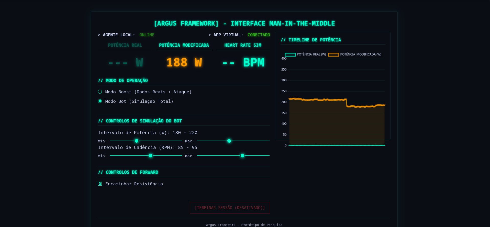

# Argus Framework

O Argus Framework é uma ferramenta de pesquisa e prototipagem para interceptar, analisar e modificar o tráfego Bluetooth Low Energy (BLE) de rolos de treino inteligentes (Smart Trainers).

Ele funciona como um proxy Man-in-the-Middle (MitM), posicionando-se entre o rolo de treino físico e o aplicativo de ciclismo virtual (como Zwift, MyWhoosh, etc.), permitindo a manipulação de dados em tempo real através de uma interface web.

## Objetivo Acadêmico

Este projeto foi desenvolvido como uma ferramenta de **cunho acadêmico** para pesquisa e prototipagem na área de segurança de protocolos de comunicação sem fio.

O objetivo é permitir a análise, instrumentação e compreensão de como os dados de dispositivos IoT (como Smart Trainers) são transmitidos, permitindo estudar vulnerabilidades, latência e métodos de spoofing de dados em um ambiente controlado.

## Funcionalidades Principais

* **Proxy MitM de Baixa Latência:** Intercepta e retransmite serviços BLE de Potência (CPS), Cadência (CSC) e Controle (FTMS).
* **Interface Web de Controle:** Um dashboard local (`http://localhost:8080`) para monitorar a potência real/modificada e injetar "ataques" de potência (aditivos ou percentuais).
* **Auto-descoberta de Hardware:** Detecta automaticamente os adaptadores Bluetooth (`hciX`) disponíveis para uso, sem necessidade de configuração manual.
* **Arquitetura Remota (Cloud):** Permite executar um `local-agent` leve em uma máquina (ex: Raspberry Pi) que é controlado por um `remote-server` na nuvem.
* **Ferramentas de Análise:** Inclui utilitários para escanear serviços BLE e analisar o jitter do sinal (`argus-scanner`) e medir latência de RTT em hardware real (`real-trainer-tester`).

## Estrutura do Projeto

O framework é dividido em vários comandos independentes:

* `/cmd/mitm-proxy`: O proxy MitM principal. Requer 2 adaptadores BLE (um para o rolo, um para o app).
* `/cmd/local-agent`: O agente leve para a arquitetura remota. Requer 1 adaptador BLE para simular o rolo virtual.
* `/cmd/remote-server`: O servidor web (feito para deploy na nuvem) que controla múltiplos `local-agent`.
* `/cmd/argus-scanner`: Ferramenta para escanear dispositivos BLE e analisar o jitter das notificações.
* `/cmd/real-trainer-tester`: Ferramenta para medir a latência de RTT (Ping/Pong) de um rolo de treino real.
* `/pkg/`: Contém a lógica BLE principal compartilhada entre os comandos.
* `/internal/web`: O servidor de WebSocket e a UI web para o `mitm-proxy`.
* `/configs/`: Arquivos de configuração.